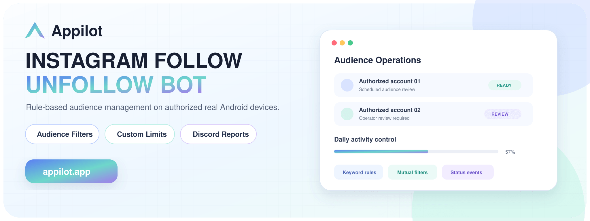
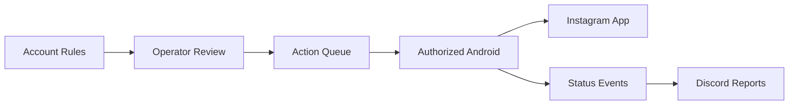
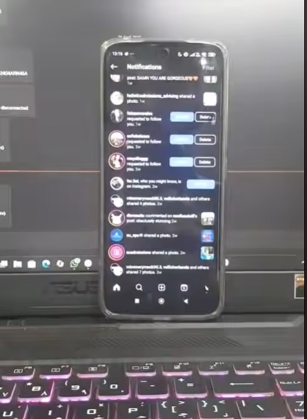
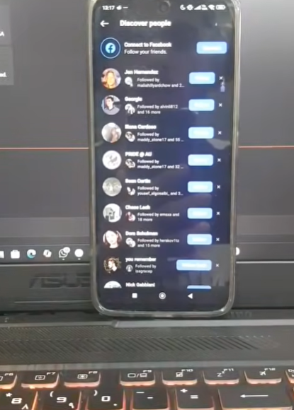
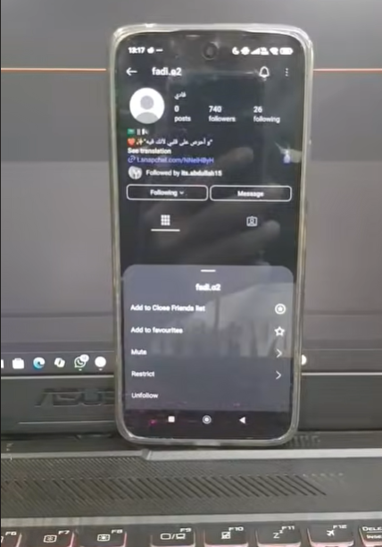

# Instagram Follow Unfollow Bot

**An Appilot product showcase for rule-based Instagram audience management on authorized real Android devices.**

[](https://www.appilot.app/) [](https://youtube.com/shorts/tKXxwPper5c)

## Demo Video

[](https://youtube.com/shorts/tKXxwPper5c)

**Watch on YouTube:** https://youtube.com/shorts/tKXxwPper5c

## Overview

This mobile-first system helps operators review and execute approved audience-management workflows inside the Instagram Android application. Rules can incorporate keywords, mutual connections, account-level schedules and explicit action limits, with operational events reported to Discord.

The public repository is documentation-only. Production implementation, credentials and private configuration are intentionally excluded.

## Core Capabilities

| Capability | What it provides |
|---|---|
| **Real Android execution** | Runs inside authorized Instagram mobile sessions. |
| **Account-level configuration** | Supports distinct rules and limits for each managed account. |
| **Audience filters** | Uses approved keywords and mutual-connection criteria. |
| **Request handling** | Surfaces follow requests for policy-based processing. |
| **Operator controls** | Allows review, pause and stop decisions. |
| **Discord reporting** | Sends task status and exception events to an operations channel. |
| **Custom scheduling** | Coordinates account workflows within defined operating windows. |

## Architecture



## Screenshots

<table align="center">
  <tr>
    <td align="center" width="33%"><br><br><b>1.</b> Audience-management workflow on a real device</td>
    <td align="center" width="33%"><br><br><b>2.</b> Follow-request review interface</td>
    <td align="center" width="33%"><br><br><b>3.</b> Account-level audience controls</td>
  </tr>
</table>

## Repository Contents

```text
instagram-follow-unfollow-bot/
├── README.md
├── ARCHITECTURE.md
├── DEMO.md
├── REPOSITORY-SETUP.md
├── RESPONSIBLE-USE.md
├── repo-metadata.json
├── LICENSE
├── .gitignore
└── assets/
    ├── banner.png
    └── screenshots/
```

## Need a Custom Instagram Audience Workflow?

Appilot can design a controlled mobile workflow with account-specific rules, human review, reporting and safety limits.

**[Discuss Your Project With Appilot](https://www.appilot.app/contact)**

[Visit Appilot](https://www.appilot.app/) · [Watch the Demo](https://youtube.com/shorts/tKXxwPper5c)

